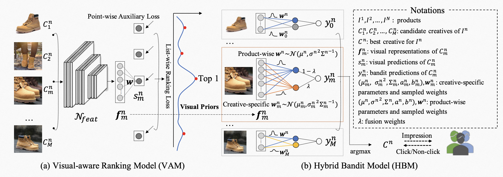
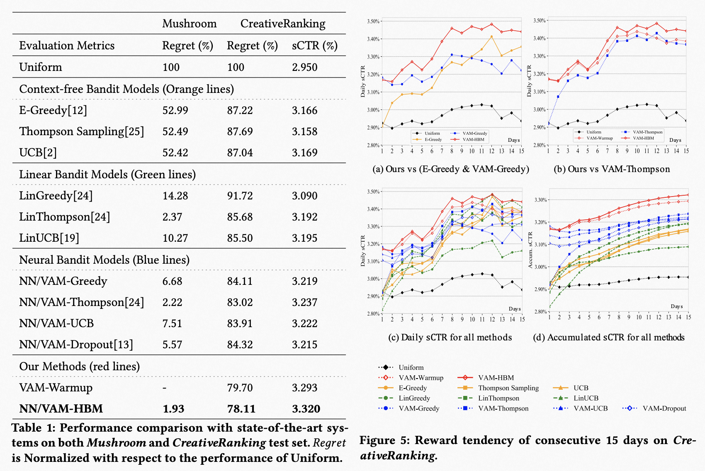

# A Hybrid Bandit Model with Visual Priors for Creative Ranking in Display Advertising


## Introduction

**A Hybrid Bandit Model with Visual Priors for Creative Ranking in Display Advertising** is initially described in an [WWW 2021 paper](https://arxiv.org/pdf/2102.04033.pdf). We propose a hybrid bandit model with visual priors which first makes predictions with a visual evaluation, and then naturally evolves to focus on the specialities. The overall framework is shown in 



The contributions of this paper include:

* We present a visual-aware ranking model (called VAM) that is capable of evaluating new creatives according to the visual appearance.
* Regarding the learned visual predictions as a prior, the improved hybrid bandit model (called HBM) is proposed to make better posteriori estimations by taking more observations into consideration.
* We construct a novel large-scale creative dataset named [CreativeRanking](https://tianchi.aliyun.com/dataset/dataDetail?dataId=93585). Extensive experiments have been conducted on both our dataset and public Mushroom dataset, demonstrating the effectiveness of the proposed method.


## Preparation for Training & Testing (Here is an example of CreativeRanking)

1. Please download [CreativeRanking dataset](https://tianchi.aliyun.com/dataset/dataDetail?dataId=93585), unzip the images.zip and list.zip to a folder (e.g. Hybrid_Bandit_Model_with_Visual_Priors/CreativeRanking/images/);


2. To perform experiments, run the python script. For example, to train the VAM, use the following command

   ```
   cd CreativeRanking
   ./run.sh
   ```

   Note that the pretrained weights (e.g. resnet18.pth, resnet101.pth) should be loaded, and the learned weights  will be saved under 

   `weights/`.

   ** Note that we use ResNet18 as an example, in fact, Rsenet50/ResNet101 can achieve better results.**

3. To extract image representations for the following HBM, run the following command

   ```
   ./run_extract.sh
   ```

   The extracted features will saved under 

   `extracted_feat/`.

4. After producing image representations, we test different bandit models by using 
   ```
   ./run_bandit.sh
   ```


## Main Results

We conduct an comparison  with state-of-the-art systems on both Mushroom and CreativeRanking test set




## Citing 

If you find A Hybrid Bandit Model with Visual Priors for Creative Ranking useful in your research, please consider citing:
```
@inproceedings{wang2021hybrid,
  title={A hybrid bandit model with visual priors for creative ranking in display advertising},
  author={Wang, Shiyao and Liu, Qi and Ge, Tiezheng and Lian, Defu and Zhang, Zhiqiang},
  booktitle={Proceedings of the Web Conference 2021},
  pages={2324--2334},
  year={2021}
}

```


